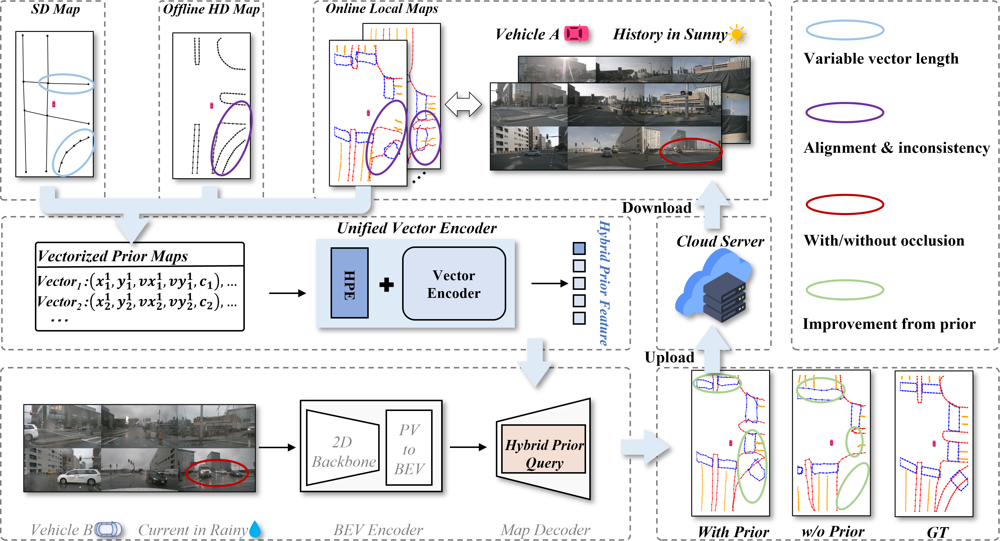

<div align="center">
<h1>PriorDrive: 

Enhancing Online HD Mapping with Unified Vector Priors

<strong>🎉🎉AAAI 2026🎉🎉</strong>

</h1>

[Shuang Zeng](https://scholar.google.com/citations?user=91lbdPcAAAAJ&hl=zh-CN)<sup>1,2\*†</sup> , [Xinyuan Chang](https://scholar.google.com.hk/citations?user=5OnPBVYAAAAJ&hl=zh-CN)<sup>2†</sup>, Xinran Liu<sup>2</sup>, Yujian Yuan<sup>1,3</sup>, Shiyi Liang<sup>1,2</sup>, Zheng Pan<sup>2</sup>, Mu Xu<sup>2</sup>, [Xing Wei](https://scholar.google.com.hk/citations?user=KNyC5EUAAAAJ&hl=zh-CN&oi=ao)<sup>1‡</sup>

<sup>1</sup> Xi’an Jiaotong University, <sup>2</sup> Amap, Alibaba Group, <sup>3</sup>The Hong Kong University of Science and Technology

[](https://arxiv.org/abs/2409.05352)
[](https://miv-xjtu.github.io/PriorDrive.github.io/)
[](https://www.modelscope.cn/models/misstl/PriorDrive_Online_Local_Prior_Maps)
[](https://www.modelscope.cn/models/misstl/PriorDrive_110ep)

</div>

## Introduction



High-Definition Maps (HD maps) are essential for the precise navigation and decision-making of autonomous vehicles, yet their creation and upkeep present significant cost and timeliness challenges. The online construction of HD maps using on-board sensors has emerged as a promising solution; however, these methods can be impeded by incomplete data due to occlusions and inclement weather, while their performance in distant regions remains unsatisfying. This paper proposes PriorDrive to address these limitations by directly harnessing the power of various vectorized prior maps, significantly enhancing the robustness and accuracy of online HD map construction.
Our approach integrates a variety of prior maps uniformly, such as OpenStreetMap's Standard Definition Maps (SD maps), outdated HD maps from vendors, and locally constructed maps from historical vehicle data. To effectively integrate such prior information into online mapping models, we introduce a Hybrid Prior Representation (HPQuery) that standardizes the representation of diverse map elements.
We further propose a Unified Vector Encoder (UVE), which employs fused prior embedding and a dual encoding mechanism to encode vector data. To improve the UVE's generalizability and performance, we propose a segment-level and point-level pre-training strategy that enables the UVE to learn the prior distribution of vector data.
Through extensive testing on the nuScenes, Argoverse 2 and OpenLane-V2, we demonstrate that PriorDrive is highly compatible with various online mapping models and substantially improves map prediction capabilities. The integration of prior maps through PriorDrive offers a robust solution to the challenges of single-perception data, paving the way for more reliable autonomous vehicle navigation.


## Table of Contents
- [🛠️ Installation](#-Installation)
- [📦 Data Preparation](#-Data-Preparation)
- [🚀 Train and Test](#-Train-and-Test)
- [📈 Visualization](#-Visualization)
- [📜 Citing](#-Citing)

## 🛠️ Installation


**a. Create a conda virtual environment and activate it.**
```shell
conda create -n priordrive python=3.8 -y
conda activate priordrive
```

**b. Install PyTorch and torchvision following the [official instructions](https://pytorch.org/).**
```shell
pip install torch==1.9.1+cu111 torchvision==0.10.1+cu111 torchaudio==0.9.1 -f https://download.pytorch.org/whl/torch_stable.html
# Recommended torch>=1.9
```

**c. Install gcc>=5 in conda env (optional).**
```shell
conda install -c omgarcia gcc-5 # gcc-6.2
```

**c. Install mmcv-full.**
```shell
pip install mmcv-full==1.4.0
#  pip install mmcv-full==1.4.0 -f https://download.openmmlab.com/mmcv/dist/cu111/torch1.9.0/index.html
```

**d. Install mmdet and mmseg.**
```shell
pip install mmdet==2.14.0
pip install mmsegmentation==0.14.1
```

**e. Install timm.**
```shell
pip install timm
```


**f. Clone PriorDrive.**
```
git clone https://github.com/MIV-XJTU/PriorDrive.git
```

**g. Install mmdet3d and GKT**
```shell
cd /path/to/PriorDrive/mmdetection3d
python setup.py develop

cd /path/to/PriorDrive/projects/mmdet3d_plugin/maptr/modules/ops/geometric_kernel_attn
python setup.py build install

```

**h. Install other requirements.**
```shell
cd /path/to/PriorDrive
pip install -r requirement.txt
```

**i. Prepare pretrained models.**
```shell
cd /path/to/PriorDrive
mkdir ckpts

cd ckpts 
wget https://download.pytorch.org/models/resnet50-19c8e357.pth
wget https://download.pytorch.org/models/resnet18-f37072fd.pth
```

## 📦 Data Preparation

## NuScenes
Download nuScenes V1.0 full dataset data  and CAN bus expansion data [HERE](https://www.nuscenes.org/download). Prepare nuscenes data by running


**Download CAN bus expansion**
```
# download 'can_bus.zip'
unzip can_bus.zip 
# move can_bus to data dir
```

**Prepare nuScenes data**

*We genetate custom annotation files which are different from mmdet3d's*
```
python tools/maptrv2/custom_nusc_map_converter.py --root-path ./data/nuscenes --out-dir ./data/nuscenes --extra-tag nuscenes --version v1.0 --canbus ./data
```

Using the above code will generate `nuscenes_map_infos_temporal_{train,val}.pkl`, which contain local vectorized map annotations.


**Get Online Local Prior**

You can directly download the pre-collected online local prior maps from [here](https://www.modelscope.cn/models/misstl/PriorDrive_Online_Local_Prior_Maps).


**Folder structure**
```
PriorDrive
├── mmdetection3d/
├── projects/
├── tools/
├── configs/
├── ckpts/
│   ├── r101_dcn_fcos3d_pretrain.pth
├── PriorDrive_Online_Local_Prior_Maps/
├── data/
│   ├── can_bus/
│   ├── nuscenes/
│   │   ├── maps/
│   │   ├── samples/
│   │   ├── sweeps/
│   │   ├── v1.0-test/
|   |   ├── v1.0-trainval/
|   |   ├── nuscenes_infos_temporal_train.pkl
|   |   ├── nuscenes_infos_temporal_val.pkl
```


## 🚀 Train and Test


Train PriorDrive with 8 GPUs 
```
./tools/dist_train.sh ./projects/configs/priordrive/maptrv2_nusc_r50_24ep.py 8
```

Eval PriorDrive with 8 GPUs
```
./tools/dist_test_map.sh ./projects/configs/priordrive/maptrv2_nusc_r50_24ep.py ./path/to/ckpts.pth 8
```


## Visualization 

we provide tools for visualization and benchmark under `path/to/PriorDrive/tools/maptr`


### Visualize prediction

```shell
cd /path/to/PriorDrive/
export PYTHONPATH="/path/to/PriorDrive/"
# visualize nuscenes dataset
python tools/maptrv2/nusc_vis_pred.py /path/to/experiment/config /path/to/experiment/ckpt

```
**Notes**: 

- All the visualization samples will be saved in `/path/to/PriorDrive/work_dirs/experiment/vis_pred/` automatically. If you want to customize the saving path, you can add `--show-dir /customized_path`.
- The score threshold is set to 0.3 by default. For better visualization, you can adjust the threshold by adding `--score-thresh customized_thresh`
- The GT is visualized in fixed_num_pts format by default, we provide multiple formats to visualize GT at the same time by setting `--gt-format`: `se_pts` means the start and end points of GT, `bbox` means the bounding box envelops the GT, `polyline_pts` means the original annotated GT (you can use Douglas-Peucker algorithm to simplify the redundant annotated points).

### Merge them into video

We also provide the script to merge the input, output and GT into video to benchmark the performance qualitatively.

```shell
python tools/maptr/generate_video.py /path/to/visualization/directory
```
**Notes**: 
- The video will be saved in `/path/to/PriorDrive/work_dirs/experiment/`


## Citation

If you find PriorDrive is useful in your research or applications, please consider giving us a star 🌟 and citing it by the following BibTeX entry.

```bibtex
@article{zeng2024driving,
  title={Driving with Prior Maps: Unified Vector Prior Encoding for Autonomous Vehicle Mapping},
  author={Zeng, Shuang and Chang, Xinyuan and Liu, Xinran and Pan, Zheng and Wei, Xing},
  journal={arXiv preprint arXiv:2409.05352},
  year={2024}
}
```


## Acknowledgements

PriorDrive is mainly based on [MapTRv2](https://github.com/hustvl/MapTR).
It is also greatly inspired by the following outstanding contributions to the open-source community: [mmdetection3d](https://github.com/open-mmlab/mmdetection3d), [BEVFusion](https://github.com/mit-han-lab/bevfusion), [BEVFormer](https://github.com/fundamentalvision/BEVFormer), [HDMapNet](https://github.com/Tsinghua-MARS-Lab/HDMapNet), [VectorMapNet](https://github.com/Mrmoore98/VectorMapNet_code).
